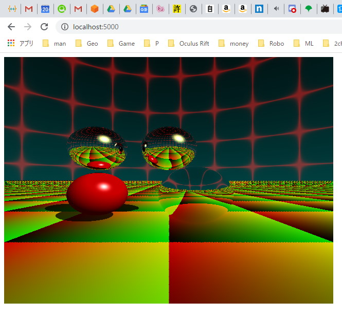

# ray-rust-wasm

Webassembly port of [ray-rust](https://github.com/msakuta/ray-rust) project.

Try it now with your browser!

https://msakuta.github.io/ray-rust-wasm/

## How to build and run

Install

* Cargo >1.40
* npm

Install wasm-pack command line tool with

    cargo install wasm-pack

Build the project

    wasm-pack build --target web

Browse http://localhost:5000/

## Screenshots

## The tutorial that I used

https://aralroca.com/blog/first-steps-webassembly-rust
